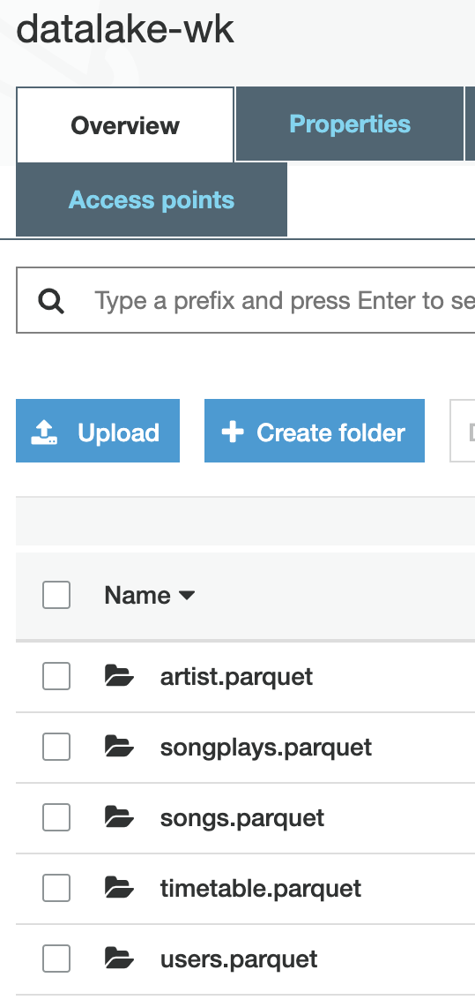

# Project Summary:
In this project we will build an ETL pipeline and a datalake for Sparkify which will read the songs metadata and the users listening activity logs, process the data in Spark and then store it as parquet files in S3 buckets. More precisely we will:
- Load song data from S3, processes it in Spark to create songs and artist table and then write the data back to S3 as parquet files
- Load log data from S3, processes it in Spark to create users, timestamp and songplays tables and then write the data back to S3 as parquet files. The songplays table will be created by using both the song and log data
---

# Schema:
**Fact table:**
- songplays (partitioned by year and month)

**Dimension table:**
- users    
- songs (partitioned by year and artist)
- artists  
- time  (partitioned by year and month)
---

# Explanation of Files in the Repository:
- **etl.py** is the main project file which creates the spark cluster, reads the songs and logs tables from an S3 bucket transforms the data and loads it back in a S3 bucket as parquet files

- **dl.cfg** contains the credentials for AWS for the user running the etl.py script

---

# Configuration for Running Scripts:
Before running the **etl.py** script from your local machine the following are the steps which need to be followed:
- Setup a Spark cluster using the Elastic Map Reduce(EMR) service through the AWS (Steps: Login to AWS -> Select EMR service -> Click create cluster)
- Generate and save keypairs for ssh which will be used to login to the Master node of the Spark cluster (Steps: Login to AWS -> Network and Security -> Key Pairs -> Create keypairs). A *.pem file will be generated which will be used later
- Ensure that the Security groups for **ElasticMapReduce-master** allows inbound ssh from your local machine. Create a rule which allows it if it does not exist already, this will be needed to allow ssh connection from the local machine
- Open the terminal and type ssh -i **PEM_FILE_PATH**.pem hadoop@**MASTER_PUBLIC_DNS**, this will connect the local machine with the cluster and we will be able to issue commands locally which will run on created spark cluster
- Create an S3 bucket in this case "s3a://datalake-wk/" was created.
- Upload the project files **etl.py** and **dl.cfg** to the created S3 bucket
- Transfer the project files to Spark master node by using the following command aws s3 cp s3://datalake-wk/etl.py .
- Submit the **etl.py** script to spark by typing **spark-submit etl.py** in the terminal. The script will run and start populating the parquet files in S3.

---

# Below is the view of parquet files created

